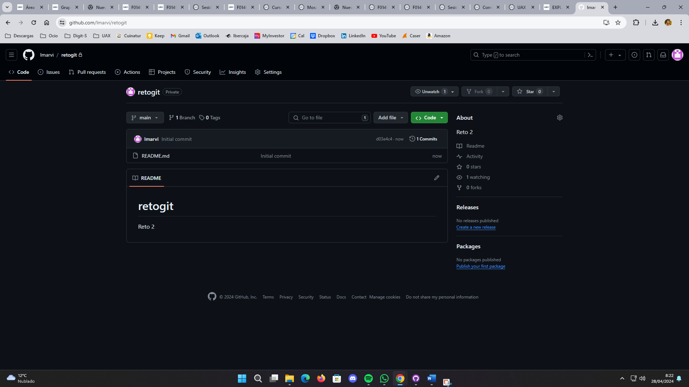
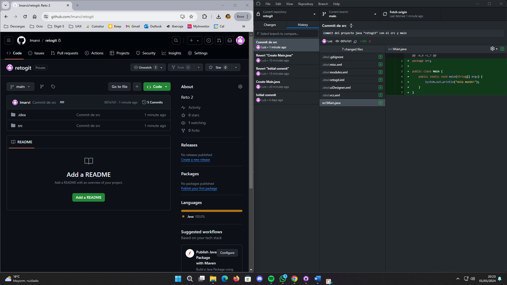
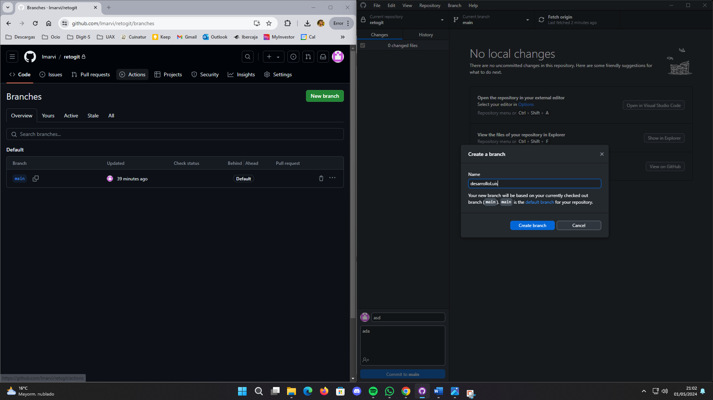
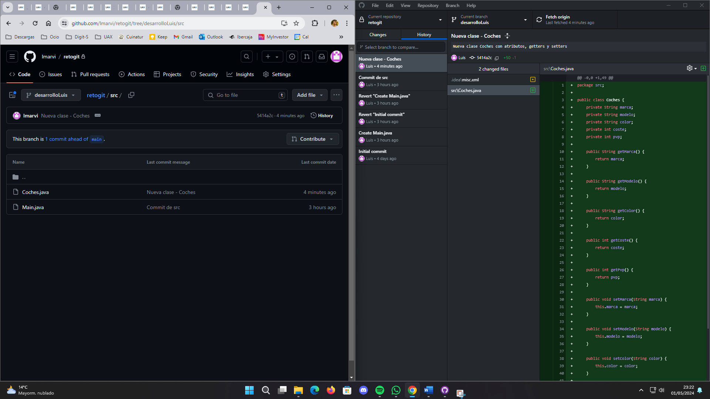
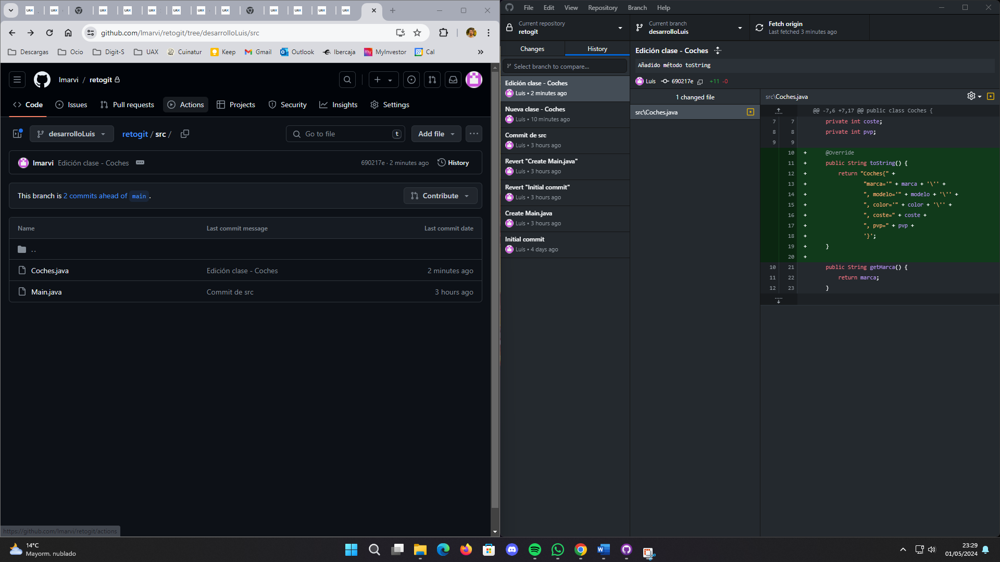
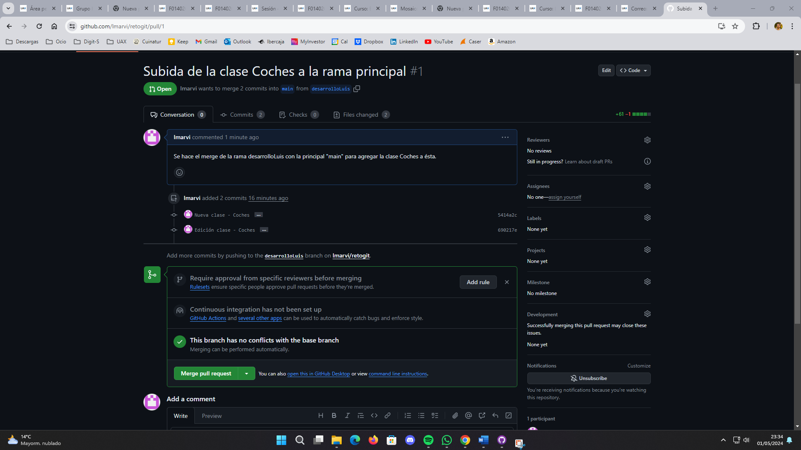

# Repositorio GitHub de Luis
 

## Creado mi primer proyecto en GitHub
>"El éxito es el resultado del trabajo duro, la dedicación y el aprendizaje del fracaso." - Colin Powell

___
### Pasos seguidos:
1. Creado un repositorio retogit, en el cual se ha sincronizado un nuevo proyecto Java.

2. Una vez realizado el commit del proyecto, se ha generado una nueva rama llamada desarrolloLuis.

3. Se ha copiado automáticamente el contenido de la rama main a la nueva rama.

4. En la rama desarrolloLuis se ha hecho el commit y push a GitHub de una nueva clase.

5. A continuación se ha hecho una modificación de la clase añadiendo un método toString.

6. Para terminar se ha realizado el merge de la rama desarrolloLuis con la rama principal y se ha terminado con el pull desde GitHub.

___
